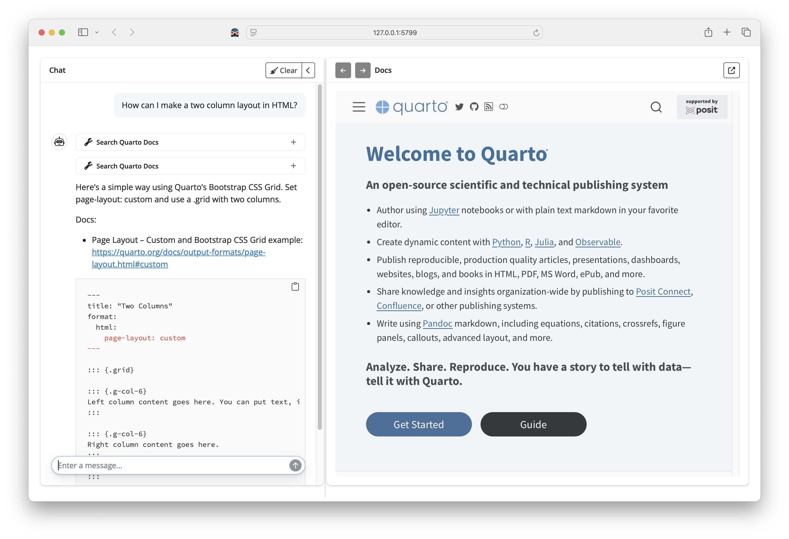

# quartohelp

<!-- badges: start -->
<!-- badges: end -->

A chat app for quick, authoritative answers from Quarto documentation.

- Chat with an LLM that searches Quarto docs using [ragnar](https://github.com/tidyverse/ragnar).
- View Quarto documentation side-by-side with the LLM’s output.

`quartohelp` launches an interactive chat interface that finds and
summarizes excerpts from Quarto docs using semantic and keyword search
(via [ragnar](https://github.com/tidyverse/ragnar)). Responses include
links to official sources to help you quickly navigate to the primary Quarto documentation.

## Screenshot



## Usage

```r
# Launch with a blank chat
quartohelp::ask()

# Start with a specific question
quartohelp::ask("How do I make a two column layout?")
````

## MCP server

Expose the store of Quarto Docs over MCP with `quartohelp::serve_store()`. This makes a
`search_quarto_docs()` tool available to other LLM apps like Codex CLI and Claude Code.


## Installation

```r
remotes::install_github("t-kalinowski/quartohelp")
```

## Requirements

* An OpenAI API key available at `Sys.getenv("OPENAI_API_KEY")`.
* Each query costs \~1–2¢ with the current flagship `gpt-5` model.
